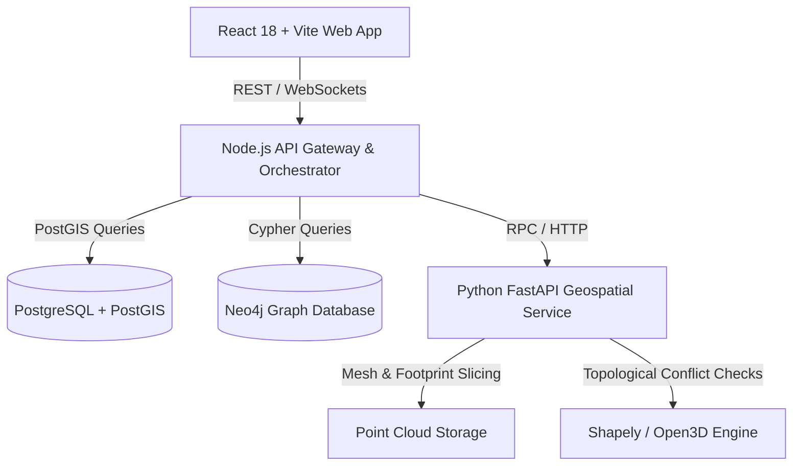

# 🏗️ Salaahkaar Architecture Overview

Salaahkaar is architected as an event-driven, decoupled spatial intelligence platform.

## System Components
1. **`apps/web`**: SPA with Three.js 3D Volumetric viewer, MapLibre GL for 2D cadastral overlay, Cytoscape / Vis.js for conflict graphs, and Tailwind/Lucide design.
2. **`apps/api`**: Express/TypeScript orchestrator handling auth, workflow state machines, and syncing relational metadata with PostGIS and Neo4j.
3. **`services/geospatial`**: High-performance Python service leveraging NumPy, Shapely, Trimesh, and Open3D for LiDAR processing, boundary reconciliation, and setback checking.
4. **`packages/shared-contracts`**: Type definitions shared between frontend and backend to guarantee strict type safety.
